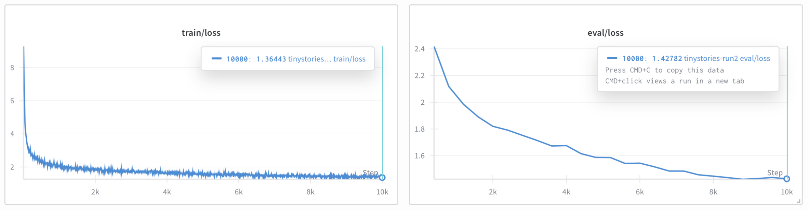

# CS336 Spring 2025 Assignment 1: Basics
| section | notes |
| --- | --- |
| [2-tokenizer](./docs/2-tokenizer.md) | Byte-Pair Encoding (BPE) Tokenizer |
| [3-transformer](./docs/3-transformer.md) | Transformer Language Model Architecture |
| [4-training](./docs/4-training.md) | Training a Transformer LM |
| [5-training-loop](./docs/5-training-loop.md) | Training loop |
| [6-generating-text](./docs/6-generating-text.md) | Generating text |

## [2-tokenizer] Training BPE
### Methodology
```
1. Initialize Vocab
2. Pre-tokenize (multi-process)
    * Calculate Pretoken frequencies (Pretoken using GPT-2 PAT pattern)
3. Build byte pair freq, reverse index pretoken
    * byte pair freq (pair_freqs): count of tuple(bytes, bytes) pair 
    * reverse index pretoken (pair_to_keys): index source (pre-token) of pair
4. Merge (loop)
    * use max-heap (-pair_count, reverse_order(pair)), use custom pair class
    4-1. Find byte pair with max count
    4-2. Add to merges, vocab
    4-3. Iterate through indexed 'key' from pair_to_keys
        * decrement 'all' pair frequencies of the old key
        * merge the target pair -> create new key
        * increment 'all' pair frequencies of the new key

freqs = {
    (b'A', b'B', b'C'): 5,
    ...
}

pair_freqs = {
    (b'A', b'B'): 5,
    (b'B', b'C'): 8,   # (5 from ABC + 3 from BC)
    (b'C', b'A'): 2
}

pairs_to_keys = {
    (b'A', b'B'): { (b'A', b'B', b'C') },
    (b'B', b'C'): { (b'A', b'B', b'C'), (b'B', b'C') },
    (b'C', b'A'): { (b'C', b'A') }
}
```

### Profiling (What part of the tokenizer training process takes the most time?)
* Test with 1 process on M1 Max (10 Core - 8 Performance + 2 Efficient)
* TinyStoriesV2-GPT4-train uses about 11G of RAM
* Pretokenization takes the majority of runtime

| input_file | total | (1) Pre-tokenize |  (2) Indexing | (3) Merge Loop |
| --- | --- | --- | --- | --- |
| corpus.en | 0.427s | 0.106s | 0.006s | 0.314s |
| tinystories_sample_5M | 1.635s | 1.248s | 0.009s | 0.376s |
| TinyStoriesV2-GPT4-train | 522.211s | 519.247s | 0.084s | 2.779s |

Training Speed by num_processes (M1 Max):
| input_file | Vocab Size | 1 | 4 | 8 |
| --- | --- | --- | --- | --- |
| tinystories_sample_5M | 10,000 | 1.635s | 0.801s | 0.704s | 
| TinyStoriesV2-GPT4-train | 10,000 | 522.211s | 131.409s | 75.210s |
| owt-train | 32,000 | - | - | 1533.620s |


## [5-training-loop]
### Tokenizer Training
Example Logs (Tinystories):
```
VOCAB SIZE 10000 NUM PROCESSES 8
OUTPUT TO results/tokenizer/tinystories-v10000
Available CPU Count: 10

Start Traininig
Calculating Pre-token Frequencies done in 74.518s with 8 processes
Building pair_freqs / pair_to_keys done in 0.099s
Made heap of size 2108
Merging done in 3.086s
Training Complete in 77.807s!
Vocab, Merges saved to results/tokenizer/tinystories-v10000
Running Tests:
ENCODED: [73, 196, 170, 294, 196, 179, 268, 196, 181, 120, 483, 33, 196, 189, 64, 33, 241, 160, 154, 132]
DECODED: Héllò hôw are ü? 🙃
```


### Model Training
Loss Example (`tinystories-run2` - Updated 250829)
- Runtime: 3h 43m
- Validation Loss (best_step_8800): 1.445 
- config: [[file](./configs/tinystories-run2.json)]


## [6-generating-text]
Example Generation:
- Give " " as prompt, max_len 256 completion tokens
```
Generated Text of len 386 in 17.303

The little girl was so excited. She ran to the kitchen and grabbed a big bowl of ice cream. She was so happy and started to eat it. 
But then, she heard a loud noise. It was a big, scary monster! The monster was so angry that it chased the little girl away. 
The little girl was so scared that she ran away and never came back. She was so sad and she never got to eat ice cream again.
```
----
----
For a full description of the assignment, see the assignment handout at
[cs336_spring2025_assignment1_basics.pdf](./cs336_spring2025_assignment1_basics.pdf)

If you see any issues with the assignment handout or code, please feel free to
raise a GitHub issue or open a pull request with a fix.

## Setup

### Environment
We manage our environments with `uv` to ensure reproducibility, portability, and ease of use.
Install `uv` [here](https://github.com/astral-sh/uv) (recommended), or run `pip install uv`/`brew install uv`.
We recommend reading a bit about managing projects in `uv` [here](https://docs.astral.sh/uv/guides/projects/#managing-dependencies) (you will not regret it!).

You can now run any code in the repo using
```sh
uv run <python_file_path>
```
and the environment will be automatically solved and activated when necessary.

### Run unit tests


```sh
uv run pytest
```

Initially, all tests should fail with `NotImplementedError`s.
To connect your implementation to the tests, complete the
functions in [./tests/adapters.py](./tests/adapters.py).

### Download data
Download the TinyStories data and a subsample of OpenWebText

``` sh
mkdir -p data
cd data

wget https://huggingface.co/datasets/roneneldan/TinyStories/resolve/main/TinyStoriesV2-GPT4-train.txt
wget https://huggingface.co/datasets/roneneldan/TinyStories/resolve/main/TinyStoriesV2-GPT4-valid.txt

wget https://huggingface.co/datasets/stanford-cs336/owt-sample/resolve/main/owt_train.txt.gz
gunzip owt_train.txt.gz
wget https://huggingface.co/datasets/stanford-cs336/owt-sample/resolve/main/owt_valid.txt.gz
gunzip owt_valid.txt.gz

cd ..
```

